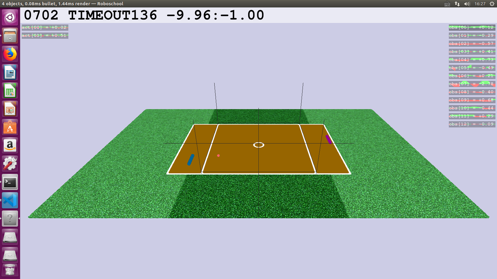

# Self-Play Pong

When I try to demo my self-play algorithm, there is no environment that supports self-play directly.
So I modify the original [RoboSchool Pong](https://github.com/openai/roboschool/blob/master/roboschool/gym_pong.py) to make it support self-play. You can also battle two different policies!

You need [Roboschool](https://github.com/openai/roboschool) to run the code.

To use this environment, see `test.py` for details. Examples:
```python
from env import make_pong_env

# If self_play = True, you can control both agents. 
# Else, you can only control the left one. 
env = make_pong_env(self_play=True)
env.reset()
for _ in range(10000):
    a = env.action_space.sample()  # Random Agent
    s, r, d, _ = env.step([a, a])
    env.render()
    if d:
        env.reset()
```

Enjoy!

